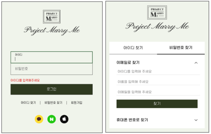

<h1>Project Marry Me</h1>

결혼 준비를 위해 필요한 것들을 한 사이트에서 예약, 구매할 수 있도록 웨딩관련 플랫폼들을 모아둔 웹 서비스입니다.

 
<h2>⛏사용기술</h2>
<h3>Frontend</h4>
<ul>
  <li><b>Language</b> : HTML5, CSS3, JavaScript</li>
  <li><b>Library & Framework</b> : JQuery, Ajax</li>
</ul>
<h3>Backend</h3>
<ul>
  <li><b>Language</b> : Java17</li>
  <li><b>Library & Framework</b> : JSP, JSTL/EL</li>
  <li><b>Database</b> : Oracle21c</li>
  <li><b>ORM</b> : MyBatis</li>
</ul>
 
<h2>✨담당 구현</h2>
<ul>
  <li>
    
메인페이지

    
    <ul>
      <li>JQuery - 메인 페이지 UI 구현</li>
      <li>JSTL/EL - 각 카테고리별 목록 인기순으로 출력</li>
      <li>Ajax, MyBatis - 페이지 전환없는 동적 탭 목록 구현</li>
    </ul>
  </li>
  <li>
    
로그인, ID/PW찾기 기능

    
    <ul>
      <li>Ajax - 로그인, ID/PW 찾기</li>
      <li>JQuery - 유효성 검사, UI 구현</li>
    </ul>
  </li>
  <li>
    
회원가입 기능

    
    <ul>
      <li>Ajax - 중복체크</li>
      <li>JQuery - 회원가입, 유효성 검사, UI 구현</li>
      <li>Daum API - 우편번호 검색</li>
      <li>JQuery UI - 달력 출력</li>
    </ul>
  </li>
  <li>
    
업체 목록 출력/검색

    
    <ul>
      <li>JSTL/EL - 목록 출력</li>
      <li>JQuery - 검색 분류별 출력</li>
      <li>Cookie - 최근 본 목록 출력</li>
    </ul>
  </li>
  <li>
    
상세페이지 출력, 위시리스트/예약 기능

    
    <ul>
      <li>JQuery - UI, 링크 복사, 유효성 검사, 예약마감일 비활성화</li>
      <li>Ajax - 위시리스트 추가/제거, 예약</li>
      <li>KAKAO API - 지도 출력</li>
    </ul>
  </li>
</ul>

